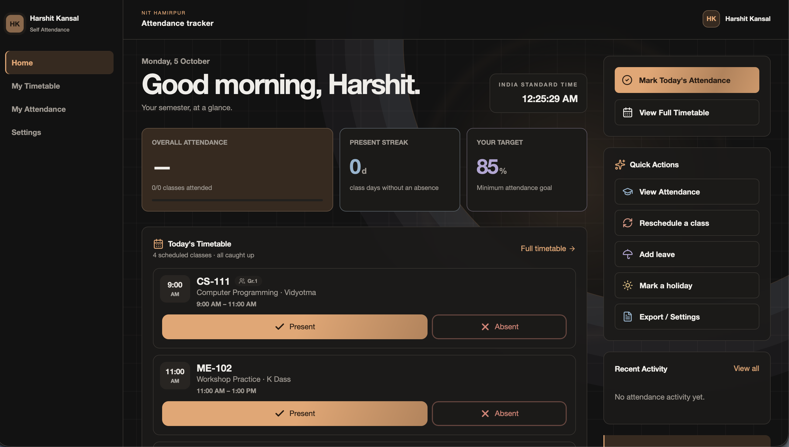

🎓 NIT Self Attendance

  
  
  
  

  <strong>📊 A modern, smart & offline-first attendance companion for students.</strong>

  
  

---

✨ What is NIT Self Attendance?

NIT Self Attendance is a student-focused attendance management Progressive Web App designed around the real academic needs of students at National Institute of Technology, Hamirpur.

It replaces manual attendance calculations, scattered notes, and spreadsheets with a clean and intuitive digital experience.

🎯 The goal is simple:

«Track attendance. Understand your status. Manage your classes. Stay on target.»

---

🖥️ Preview

  

---

🚀 Features

<table>
<tr>
<td width="50%">⚡ One-Tap Attendance

Quickly mark classes as:

- ✅ Present
- ❌ Absent
- ↩️ Undo

</td><td width="50%">📊 Smart Analytics

Understand your attendance through:

- Subject-wise percentage
- Present/absent count
- Attendance trends
- Attendance status

</td>
</tr><tr>
<td>📅 Smart Timetable

Manage your complete weekly schedule and keep your academic routine organized.

</td><td>⏰ Current & Upcoming Classes

Know what class is happening now and what is coming next.

</td>
</tr><tr>
<td>⚠️ Attendance Alerts

Identify subjects where your attendance is getting close to the required limit.

</td><td>🏖️ Leave & Holiday Support

Handle leaves, holidays and non-regular academic days without breaking your records.

</td>
</tr><tr>
<td>🔄 Rescheduled Classes

Keep your attendance aligned when classes are moved to another date or time.

</td><td>❌ Cancelled Classes

Record cancelled classes and maintain a more accurate academic history.

</td>
</tr><tr>
<td>📝 Exam Support

Manage examination schedules alongside your regular academic calendar.

</td><td>💾 Import & Export

Backup and transfer attendance data using JSON/CSV.

</td>
</tr><tr>
<td>📱 PWA

Install the application on supported devices and use it like a native app.

</td><td>🌐 Offline First

Your attendance data remains accessible even when internet connectivity is unavailable.

</td>
</tr></table>---

🎨 Designed For Students

The interface focuses on speed, clarity and minimal effort.

🌙 Dark Mode

Comfortable viewing in low-light environments.

☀️ Light Mode

Clean and bright interface for daytime use.

📱 Mobile First

Designed around the device students use most — their phone.

⚡ Fast

Built with modern frontend technologies for a responsive experience.

---

📈 Attendance Intelligence

Instead of only storing numbers, the application helps students understand their attendance.

For example:

┌──────────────────────────────────┐
│        Data Structures           │
├──────────────────────────────────┤
│                                  │
│          18 / 20                 │
│           90%                    │
│                                  │
│        🟢 Attendance Safe        │
│                                  │
└──────────────────────────────────┘

Students can quickly identify:

🟢 Safe — Attendance is comfortably above target

🟡 Warning — Attendance requires attention

🔴 Critical — Attendance needs immediate improvement

---

🧩 Built With

Technology| Role
⚛️ React| Frontend UI
🔷 TypeScript| Type-safe application logic
⚡ Vite| Development & build tooling
🎨 Tailwind CSS| Styling
🧩 shadcn/ui| UI components
🗄️ Supabase| Optional cloud synchronization
💾 Local Storage| Local/offline persistence
📱 PWA| Installable app experience
▲ Vercel| Deployment

---

🏫 Made For NIT Hamirpur

This project is designed around the academic experience of students at:

🏛️ National Institute of Technology, Hamirpur

Himachal Pradesh, India 🇮🇳

The application aims to make one of the most repetitive parts of college life — attendance management — faster and easier.

---

🌟 Why NIT Self Attendance?

Traditional attendance tracking can involve:

❌ Manual calculations
❌ Spreadsheet maintenance
❌ Forgetting previous attendance
❌ Difficulty tracking individual subjects
❌ Confusion during holidays/rescheduled classes
❌ No quick way to check attendance status

NIT Self Attendance brings it together:

📅 Timetable + ✅ Attendance + 📊 Analytics + ⚠️ Alerts + 💾 Backup

All in one place.

---

🔐 Data & Privacy

The application follows an offline-first approach, allowing attendance information to remain available locally on the device.

Optional cloud synchronization can be configured using Supabase.

«🔒 Your attendance is your data.»

---

🛣️ Roadmap

✅ Completed

- [x] Attendance tracking
- [x] Timetable management
- [x] Subject analytics
- [x] Leave management
- [x] Holiday support
- [x] Rescheduled classes
- [x] Cancelled classes
- [x] Exam support
- [x] Import / Export
- [x] Dark / Light mode
- [x] PWA support
- [x] Offline-first storage
- [x] Vercel deployment

🚧 Coming Soon

- [ ] 🔔 Smart attendance reminders
- [ ] 🤖 AI attendance prediction
- [ ] 📈 Advanced attendance forecasting
- [ ] 📱 Enhanced Android experience
- [ ] 🔐 Improved authentication
- [ ] ☁️ Advanced multi-device sync
- [ ] 📄 PDF attendance reports
- [ ] 📊 Advanced semester analytics

---

🚀 Run Locally

Clone

git clone https://github.com/Harshitkansal001/Harshit-Kansal-Attendance.git

Enter the project

cd Harshit-Kansal-Attendance

Install dependencies

npm install

Start development server

npm run dev

Build for production

npm run build

---

🌐 Live Application

🚀 Try NIT Self Attendance

---

👨‍💻 Creator

Harshit Kansal

B.Tech CSE Dual Degree
National Institute of Technology, Hamirpur

Built with ❤️, curiosity & code at <strong>NIT Hamirpur</strong> 🇮🇳

---

⭐ Support

If you find NIT Self Attendance useful:

⭐ Star this repository
🍴 Fork it
🐛 Report bugs
💡 Suggest improvements
🤝 Contribute

Every star and suggestion helps the project grow.

---

🎓 NIT Self Attendance

Track smarter. Attend better. Stay on target.

 Made by <strong>Harshit Kansal</strong> • NIT Hamirpur

